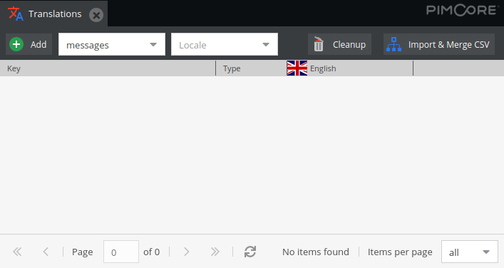
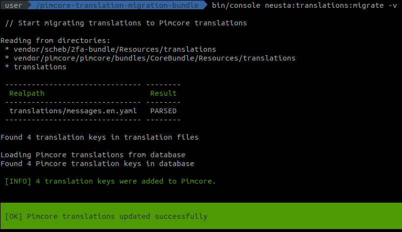
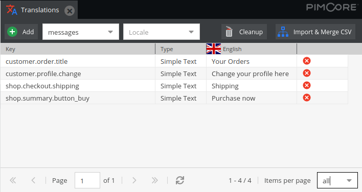

# Documentation

## Usage Example

Here is an example of a symfony YAML file with translations, located in `$PROJECT_DIR/translations/messages.en.yaml`.

```yaml
shop:
  checkout:
    shipping: 'Shipping'
  summary:
    button_buy: 'Purchase now'
customer:
  order:
    title: 'Your Orders'
  profile:
    change: 'Change your profile here'
```

In a fresh Pimcore installation, the translations for the domain `messages` are empty.



Then execute the command of this bundle. Here is the output, when using verbose mode.



After that, reload the Pimcore translations and see the result.



Executing the command another time, without changing anything, would result in the same output. Only if a Pimcore translation is changed, it will be skipped during migration. The `creationDate` and `modificationDate` timestamps are compared when looking for changes.
